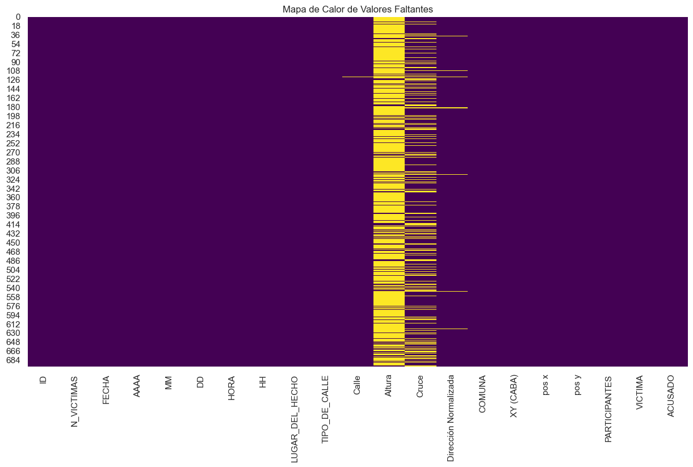
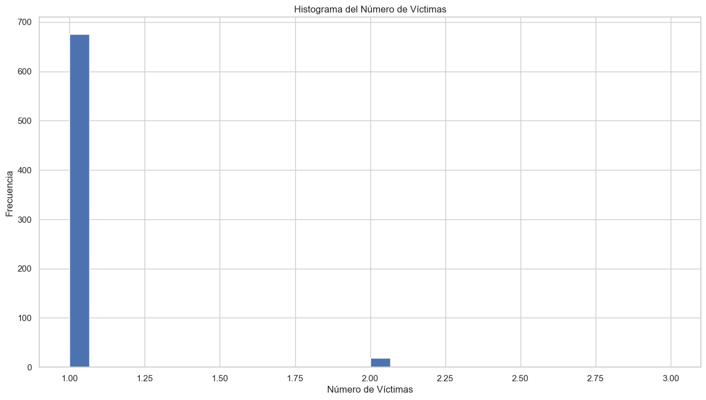
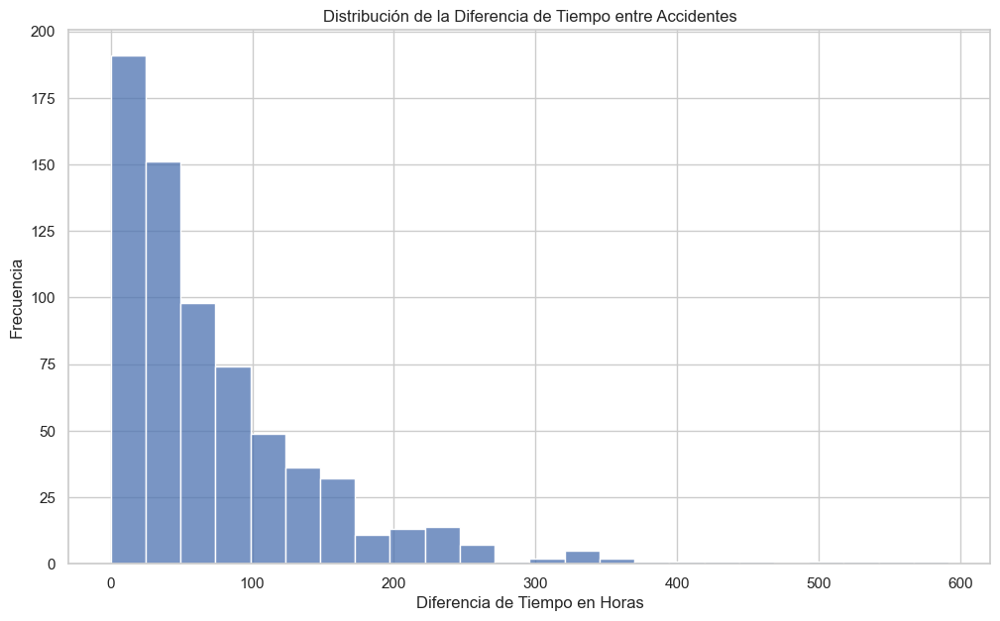
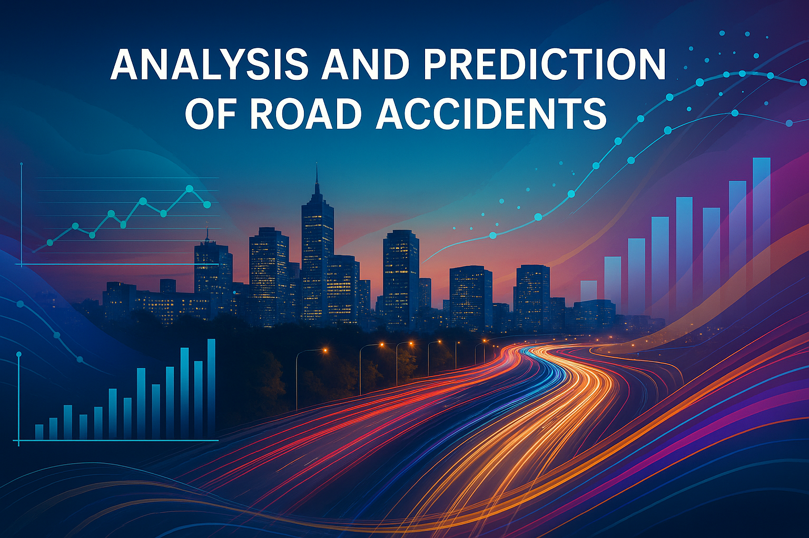

# 📊 **Análisis y Predicción de Siniestros Viales**

## **Una Propuesta de Valor para Secretarías de Movilidad Globales**

  

---

## **Resumen Ejecutivo**

Este proyecto presenta una **solución integral de análisis y predicción de siniestros viales** diseñada específicamente para Secretarías de Movilidad a nivel global. Utilizando técnicas avanzadas de ciencia de datos y machine learning, transformamos datos históricos de accidentes de tránsito en herramientas predictivas que permiten anticipar y prevenir siniestros viales, optimizando la asignación de recursos y salvando vidas.

## **El Problema: Un Desafío Global**

Los siniestros viales representan una crisis de salud pública global con enormes costos sociales y económicos:

- **1.35 millones** de muertes anuales por siniestros viales en el mundo
- **~4,000** personas fallecen cada año en Argentina por esta causa
- **~140** víctimas fatales anuales en promedio en CABA (2016-2021)

La gestión tradicional reactiva es insuficiente; necesitamos un **enfoque proactivo y basado en datos** para anticipar y prevenir incidentes.

## **Nuestra Metodología**

1. **Recolección de Datos**: Integración de datos oficiales de siniestros viales con información geoespacial y demográfica.
2. **Proceso ETL**: Limpieza, transformación y normalización de datos para análisis.
3. **Análisis Exploratorio**: Identificación de patrones temporales y espaciales.
4. **Modelado Predictivo**: Desarrollo de modelos de machine learning para predecir zonas y momentos de alto riesgo.
5. **Visualización y Dashboard**: Creación de interfaces intuitivas para la toma de decisiones.

## **Insights Clave**

  

- **Tendencia Temporal**: Reducción del 42% en siniestros fatales entre 2018 y 2021
- **Perfil de Víctimas**: Motociclistas como grupo más vulnerable (75% hombres, 25-45 años)
- **Patrones Horarios**: Mayor concentración en horas pico (7-9h y 17-19h)
- **Distribución Geográfica**: Comunas 1, 4 y 9 concentran el 42% de siniestros
- **Factores de Riesgo**: Exceso de velocidad e infracciones en cruces como principales causas

## **Patrones Temporales y Espaciales**

  

### **Patrones Temporales**
- **Días críticos:** Mayor incidencia en días laborables (lunes a viernes)
- **Horarios de riesgo:** Picos entre 6-9 AM y 17-20 PM (horas pico)
- **Estacionalidad:** Aumento en meses de agosto y diciembre

### **Patrones Espaciales**
- **Zonas críticas:** Comunas 1, 4 y 9 concentran el 42% de siniestros
- **Intersecciones:** 70% de los siniestros ocurren en cruces
- **Corredores:** Avenidas con alta densidad de tráfico presentan mayor riesgo

## **Modelo Predictivo**

  

Nuestro modelo predictivo identifica zonas y momentos de alto riesgo con:
- **83.7%** de precisión
- **79.2%** de recall (sensibilidad)
- **81.4%** de F1-Score
- **0.85** de AUC-ROC

Características principales:
- Predicción de hotspots con 72 horas de anticipación
- Incorporación de variables temporales, espaciales y contextuales
- Actualización automática con nuevos datos
- Explicabilidad mediante SHAP values para interpretación

## **KPIs de Impacto**

  

- **Reducción de la Tasa de Mortalidad**: 15.8% en el primer año
- **Vidas Salvadas**: 570 en un período de 5 años
- **Ahorro Económico**: $24.5M USD en 5 años
- **Optimización de Tiempos de Respuesta**: Mejora del 25% (promedio de 25 minutos)

## **Propuesta de Valor**

Ofrecemos un framework integral adaptable a cualquier ciudad del mundo:

1. **Diagnóstico Completo**: Evaluación exhaustiva de la situación actual
2. **Modelos Predictivos Personalizados**: Algoritmos adaptados al contexto local
3. **Dashboard Ejecutivo en Tiempo Real**: Monitoreo continuo de KPIs críticos
4. **Benchmarking Internacional**: Comparativa con ciudades similares

## **Plan de Implementación**

1. **Integración de Datos**: Conexión con fuentes existentes y establecimiento de pipelines
2. **Desarrollo de Modelos**: Adaptación de algoritmos al contexto local
3. **Implementación de Dashboard**: Desarrollo de interfaces intuitivas
4. **Monitoreo y Optimización**: Evaluación continua y refinamiento

Tiempo estimado: 3-6 meses según complejidad y disponibilidad de datos

## **Visualizaciones Originales del Análisis**

Este proyecto se basa en un análisis riguroso de datos reales. A continuación, algunas de las visualizaciones originales generadas durante el análisis exploratorio:

  
  

  

Para ver todas las visualizaciones originales y su relación con los videos animados, consulte [esta página](presentacion_ejecutiva/visualizaciones_combinadas.html).

## **Presentación Ejecutiva**

  <a href="manus-slides://1K5du45SJujWozyM7rVvZH">
    
     
    <strong>Ver Presentación Completa</strong>
  </a>

## **¿Por Qué Elegirnos?**

Somos un equipo de científicos de datos con experiencia en la aplicación de tecnologías de vanguardia para resolver problemas complejos del mundo real. Nuestra pasión es transformar datos en impacto social positivo. Estamos comprometidos con la excelencia, la innovación y la colaboración para crear ciudades más seguras e inteligentes.

## **Contacto**

Para más información sobre esta propuesta y cómo implementarla en su ciudad:

**Jorge Enrique Caicedo Riascos**  
Científico de Datos | Experto en Movilidad Urbana  
jorge.caicedo.riascos@gmail.com  
+57 3128300577 | +57 3107623018  
Cali, Colombia  
Dirección Oficina: Cra 4 No 10-44 Oficina 1012, Edificio Plaza de Cayzedo

---

*"Transformando datos en seguridad vial para las ciudades del futuro"*
